

  

<h1 align="center">C.A.R.E Colposcopy</h1>
<h3 align="center">Computer-Aided Recognition & Evaluation</h3>
<h4 align="center">Document Technique — Application d'imagerie medicale pour la colposcopie assistee par IA</h4>

  
  
  
  

---

## 1. Introduction

Le **cancer du col de l'uterus** reste l'un des cancers les plus meurtriers chez la femme dans les pays en developpement, avec plus de 340 000 deces par an dans le monde. La colposcopie est l'examen de reference pour le depistage precoce des lesions precancereuses, mais son accessibilite reste limitee par le manque d'equipements numeriques adaptes et le cout eleve des solutions existantes.

**C.A.R.E Colposcopy** (Computer-Aided Recognition & Evaluation) est une application medicale cross-platform qui numerise et ameliore le flux de travail colposcopique complet : de la capture d'images avec filtre vert medical, a l'annotation, l'analyse par intelligence artificielle, et la generation automatique de rapports cliniques.

L'application est concue pour etre deployee aussi bien sur des smartphones et tablettes cliniques que sur des postes de travail hospitaliers, et sera integree dans le **futur prototype hardware dedie C.A.R.E** — un dispositif medical autonome de colposcopie numerique.

---

## 2. Demonstration video

La video ci-dessous presente une demonstration complete de l'application, montrant l'ensemble du parcours utilisateur :

**[Voir la demonstration video](assets_v2/demo.mp4)**

> *Duree : 4 min 30 | Navigation complete : connexion, gestion des patients, capture d'images avec filtre vert, annotation medicale, generation de rapport PDF, statistiques, parametres.*

---

## 3. Apercu des ecrans

### 3.1 Page de connexion
Authentification securisee avec gestion multi-roles (Super Admin, Admin, Docteur, Assistant). Interface medicale professionnelle avec le branding C.A.R.E.

`[INSERER : assets_v2/screenshots/01_login.png]`

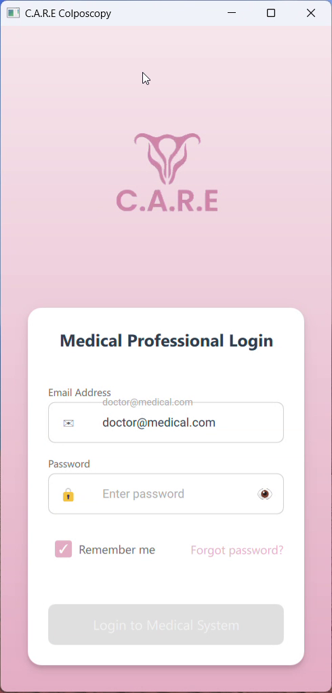

---

### 3.2 Tableau de bord
Ecran d'accueil personnalise affichant le nom du praticien connecte (Dr. Aissatou Diallo — Gynecologie), avec acces rapide aux fonctions principales : Nouvel Examen, Patients, Rapports, Statistiques. Liste des examens recents en bas de page.

`[INSERER : assets_v2/screenshots/02_home.png]`

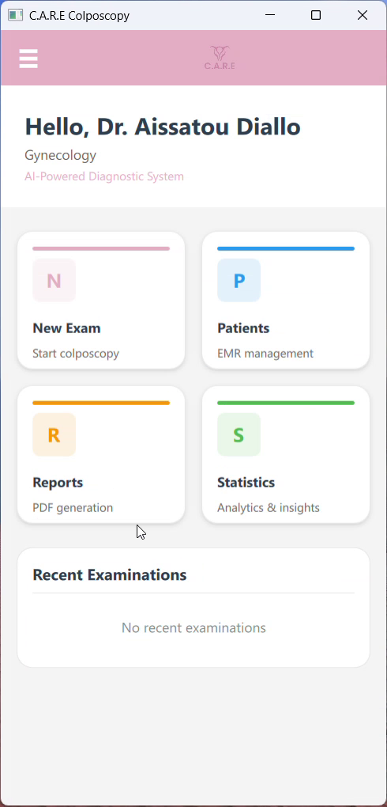

---

### 3.3 Selection du patient
Registre complet des patients avec recherche en temps reel par nom ou numero de dossier medical (MRN). Affichage des avatars, dates de naissance et identifiants. Bouton d'ajout rapide d'un nouveau patient.

`[INSERER : assets_v2/screenshots/03_patient_list.png]`

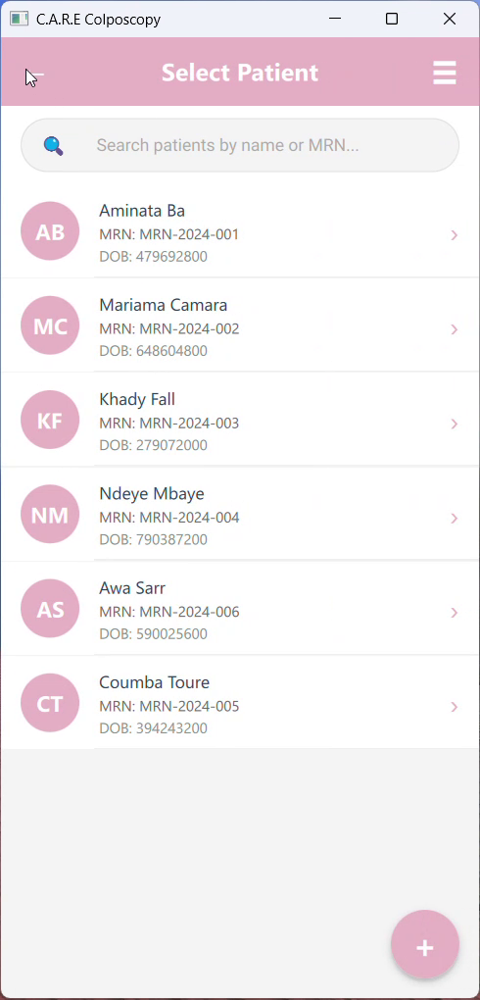

---

### 3.4 Interface camera — vue normale
Capture d'images colposcopiques en temps reel avec controles lateraux : LED (eclairage), Filtre vert, Zoom, Exposition. Barre d'etat en bas affichant le mode, le nombre d'images capturees et le MRN du patient.

`[INSERER : assets_v2/screenshots/04_camera.png]`

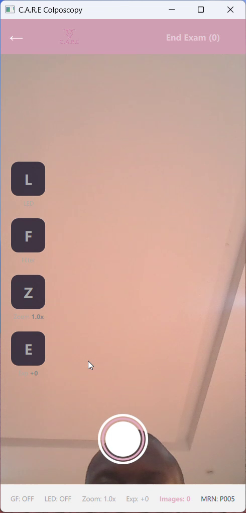

---

### 3.5 Interface camera — filtre vert medical
Le **filtre vert medical** (shader GPU OpenGL ES 3.0) amplifie le canal vert pour mieux visualiser les patterns vasculaires cervicaux — equivalent numerique du filtre optique vert utilise en colposcopie traditionnelle. Curseur d'intensite du filtre (Green Level) ajustable en temps reel.

`[INSERER : assets_v2/screenshots/05_camera_green_filter.png]`

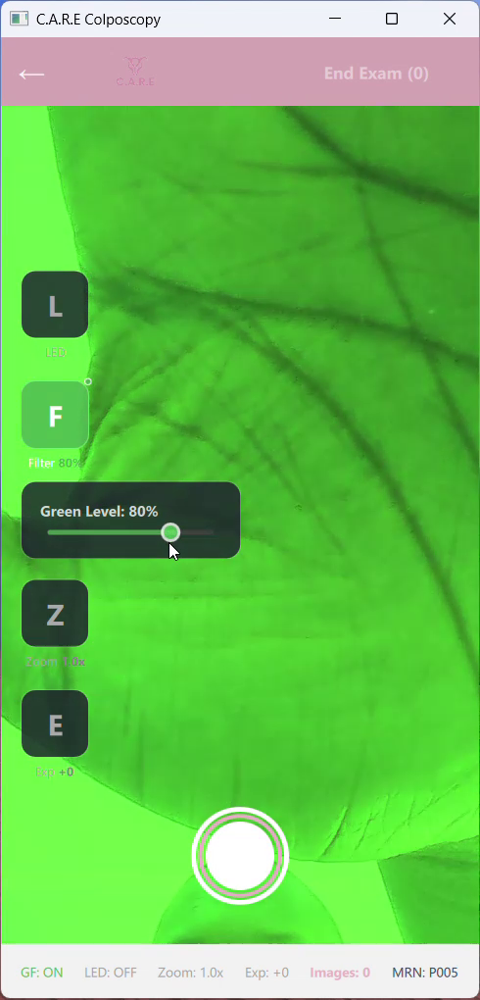

---

### 3.6 Capture d'image
Apres la prise de photo, une vignette s'affiche en bas a droite confirmant la capture. Le compteur d'images est mis a jour en temps reel dans la barre d'etat.

`[INSERER : assets_v2/screenshots/06_camera_capture.png]`

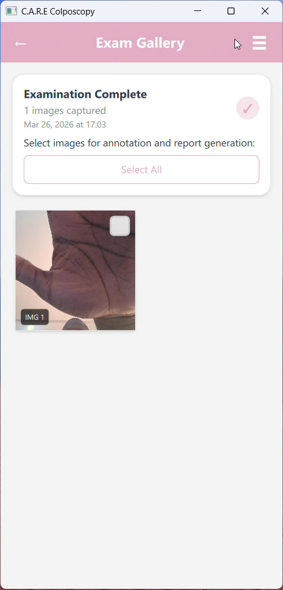

---

### 3.7 Galerie d'examen
Visualisation des images capturees lors d'un examen. Selection multiple pour annotation groupee ou generation de rapport. Boutons d'action : Annoter, Rapport, Supprimer.

`[INSERER : assets_v2/screenshots/07_exam_gallery.png]`

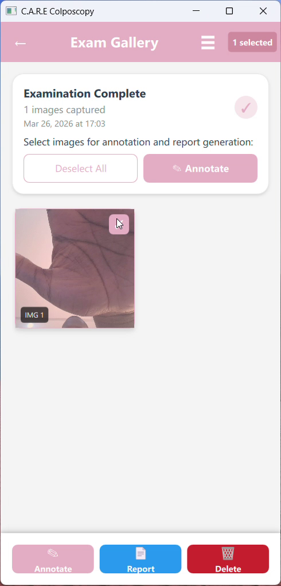

---

### 3.8 Annotation medicale — mesures
Suite d'outils d'annotation avec mesures en millimetres : cercles pour delimiter les zones d'interet, lignes de mesure, et marqueurs. Bouton d'**analyse IA** integre.

`[INSERER : assets_v2/screenshots/08_annotation.png]`

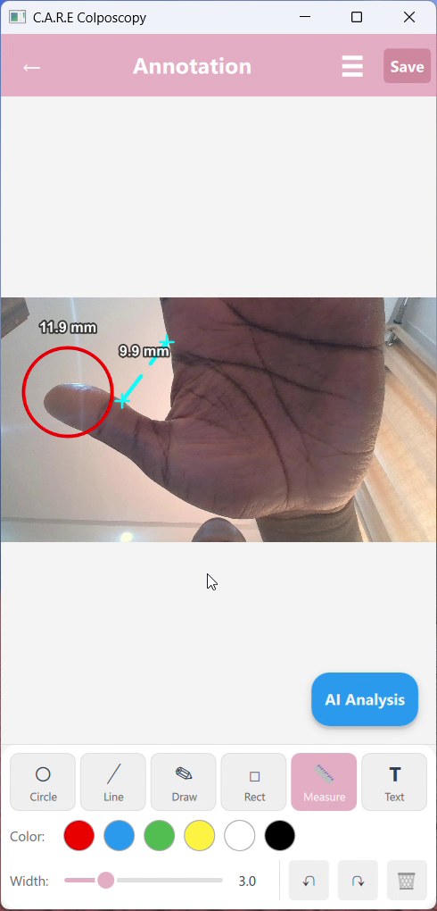

---

### 3.9 Selection des images pour le rapport
Apres annotation, retour a la galerie d'examen avec les 2 images selectionnees (originale et annotee). L'image annotee affiche les mesures et marqueurs. Selection multiple pour inclure les images dans le rapport PDF via le bouton « Report ».

`[INSERER : assets_v2/screenshots/09_annotation_tools.png]`

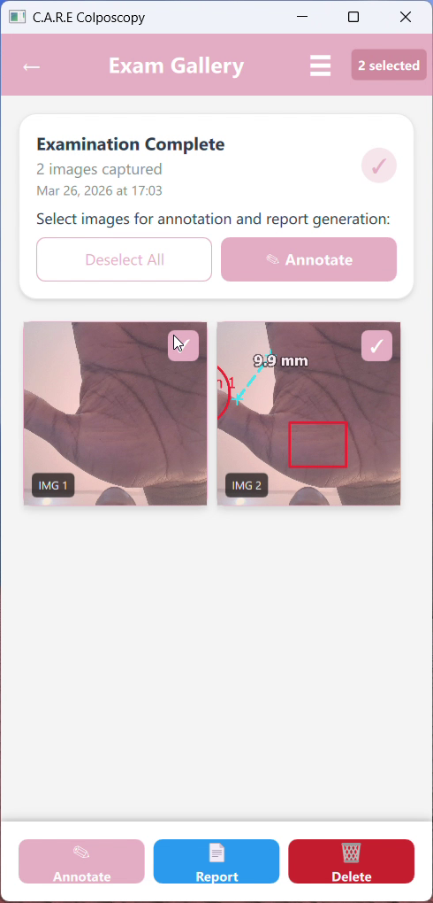

---

### 3.10 Generation de rapport
Formulaire structure de rapport colposcopique : informations patient (nom, DOB, MRN, telephone, email), indication clinique, apparence cervicale, zone de transformation (type 1/2/3), resultats a l'acide acetique et a l'iode, patterns vasculaires.

`[INSERER : assets_v2/screenshots/10_report_generation.png]`

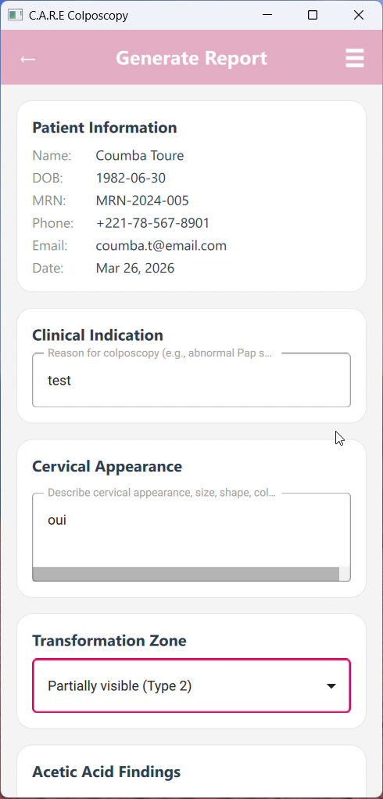

---

### 3.11 Rapport PDF genere
Apercu du rapport PDF genere automatiquement au format C.A.R.E. Contient les informations du patient, les constatations cliniques, et les images annotees. Ouverture directe dans le navigateur.

`[INSERER : assets_v2/screenshots/11_report_pdf.png]`

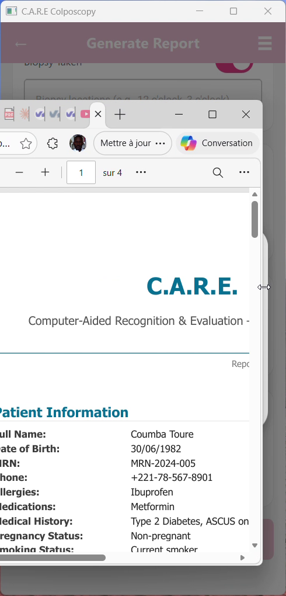

---

### 3.12 Fiche patient detaillee
Dossier patient complet avec onglets Info / Galerie / Rapports. Informations de contact, informations medicales (allergies, medicaments, antecedents), informations gynecologiques. Bouton « Demarrer un examen » pour lancer directement une colposcopie.

`[INSERER : assets_v2/screenshots/12_patient_detail.png]`

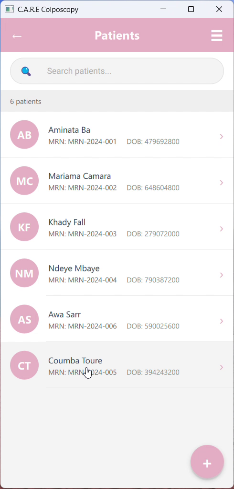

---

### 3.13 Galerie patient
Onglet Galerie de la fiche patient affichant toutes les images capturees lors des differents examens, avec vignettes et annotations visibles.

`[INSERER : assets_v2/screenshots/13_patient_gallery.png]`

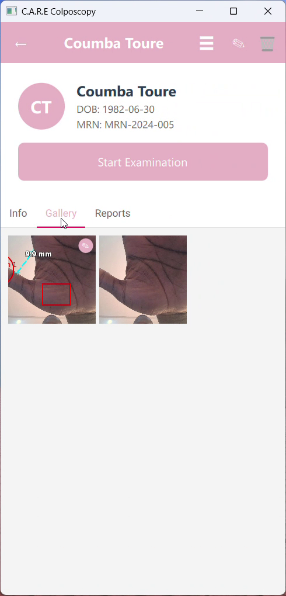

---

### 3.14 Rapports du patient
Acces aux rapports generes pour un patient avec options : Ouvrir, Partager, Supprimer.

`[INSERER : assets_v2/screenshots/14_patient_report.png]`

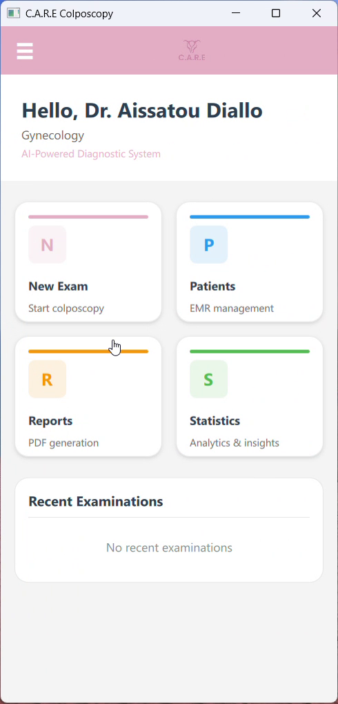

---

### 3.15 Edition du dossier patient
Formulaire d'edition complet des informations personnelles du patient : nom, prenom, date de naissance, telephone, email, adresse, numero de dossier medical (MRN). Interface structuree avec champs valides et icones contextuelles.

`[INSERER : assets_v2/screenshots/15_edit_patient.png]`

---

### 3.16 Statistiques
Tableaux de bord analytiques : compteurs (patients, examens, taux d'anomalies), examens par mois (graphique barres), distribution des lesions (graphique circulaire), tendances de confiance IA, distribution d'age.

`[INSERER : assets_v2/screenshots/16_statistics.png]`

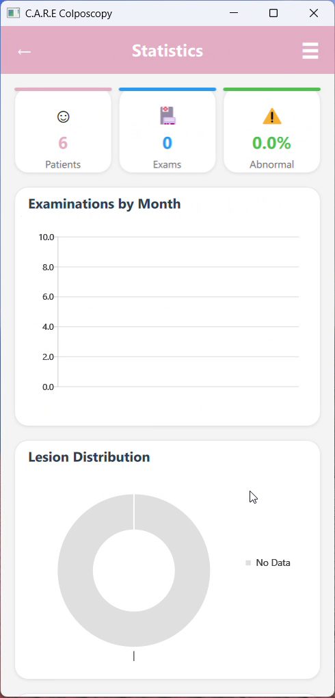

---

### 3.17 Parametres
Configuration de l'application : langue (Francais/Anglais), qualite d'image (Low/Medium/High/Maximum), analyse IA automatique, emplacement de stockage, sauvegarde automatique et manuelle de la base de donnees.

`[INSERER : assets_v2/screenshots/17_settings.png]`

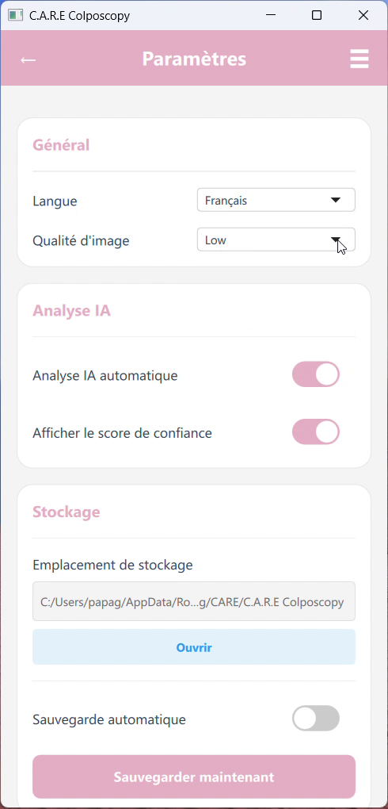

---

### 3.18 Profil utilisateur
Gestion du profil du praticien : email, departement, specialisation, numero de licence medicale. Changement de mot de passe securise.

`[INSERER : assets_v2/screenshots/18_profile.png]`

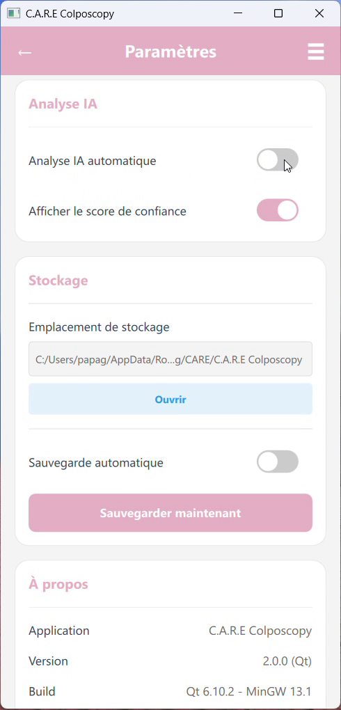

---

### 3.19 Menu de navigation
Tiroir lateral avec identification du praticien connecte (Dr. Aissatou Diallo — DOCTOR). Acces rapide : Accueil, Patients, Rapports, Statistiques, Profil, Parametres, Deconnexion.

`[INSERER : assets_v2/screenshots/19_navigation_drawer.png]`

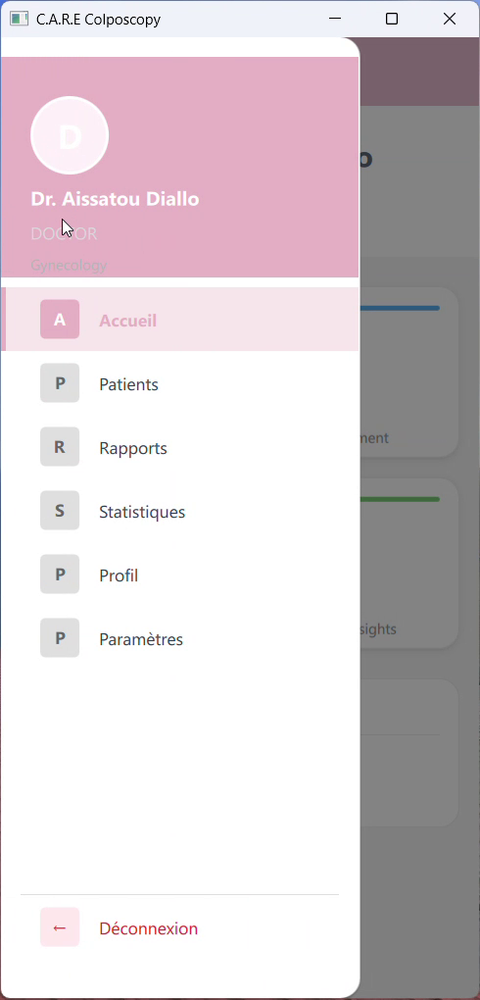

---

## 4. Stack technologique

| Composant | Technologie | Justification |
|-----------|-------------|---------------|
| **Framework** | Qt 6.10 (C++17 + QML/JavaScript) | Cross-platform natif, performance medicale, certification facilitee |
| **Base de donnees** | SQLite avec WAL mode | Leger, embarque, hors-ligne, performant |
| **Intelligence artificielle** | TensorFlow Lite | Detection de lesions cervicales, inference embarquee sur mobile |
| **Rendu medical** | OpenGL ES 3.0 (shader GPU) | Filtre vert medical temps reel, traitement d'image GPU |
| **Architecture** | MVC (Modele-Vue-Controleur) | Separation claire services / modeles / vues |
| **Langage principal** | C++17 | Performance native, gestion memoire deterministe |
| **Interface utilisateur** | QML + JavaScript | UI declarative fluide, animations materielles |
| **Rapports** | Generation PDF native | Rapports cliniques structures automatiques |
| **Securite** | SHA-256, verrouillage de compte | Protection des donnees medicales |

---

## 5. Pourquoi Qt C++ pour un logiciel de sante

Le choix de **Qt C++** comme framework principal n'est pas anodin pour une application medicale. Il repond a des exigences specifiques de l'industrie de la sante :

- **Conformite IEC 62304** : La norme internationale pour le cycle de vie des logiciels de dispositifs medicaux est facilitee par le C++ deterministe — pas de garbage collector, pas de comportement imprevisible en memoire, tracabilite complete de l'execution.

- **Certification CE / FDA** : Qt est deja utilise dans l'industrie medicale (dispositifs IRM Siemens, moniteurs patient Philips, systemes d'imagerie GE Healthcare). L'ecosysteme Qt dispose d'outils de tracabilite et de tests valides pour la certification.

- **Un seul codebase, toutes les plateformes** : Le meme code source compile pour Android, Windows, iOS et Linux. Cela **reduit considerablement les couts de certification** car une seule base de code doit etre validee, testee et documentee.

- **Performance temps reel** : Le traitement d'images medicales et le rendu GPU (filtre vert, annotations) necessitent des performances natives que seul le C++ peut garantir sur des appareils mobiles a ressources limitees.

- **Pas de dependance cloud** : L'application fonctionne entierement hors-ligne, un critere essentiel pour les environnements medicaux ou la connectivite n'est pas garantie et ou la souverainete des donnees est obligatoire.

---

## 6. Plateformes cibles

| Plateforme | Statut | Usage prevu |
|-----------|--------|-------------|
| **Android** (ARM64, ARMv7) | En cours | Smartphones et tablettes cliniques |
| **Windows** (x64) | Fonctionnel | Postes de travail en hopital/clinique |
| **iOS** (ARM64) | Prevu | iPad pour consultations mobiles |
| **Prototype hardware C.A.R.E** | Prevu | **Le logiciel sera embarque dans le futur dispositif medical dedie C.A.R.E** — un colposcope numerique autonome integrant camera haute definition, eclairage medical, et traitement IA embarque |

---

## 7. Fonctionnalites principales

- **Authentification multi-roles** : Super Admin, Admin, Docteur, Assistant — chaque role dispose de permissions specifiques
- **Gestion complete des dossiers patients** : Creation, modification, recherche, historique medical, informations gynecologiques
- **Capture d'images colposcopiques** avec filtre vert medical en temps reel (shader GPU)
- **Annotation medicale avancee** : Cercle, ligne, dessin libre, rectangle, mesures en mm, texte
- **Analyse IA des lesions cervicales** : Classification automatique, score de confiance (TensorFlow Lite)
- **Generation automatique de rapports PDF** : Format clinique structure avec images annotees
- **Export CSV** des donnees cliniques pour analyse externe
- **Statistiques et tableaux de bord** : Distribution des lesions, tendances IA, demographique patients
- **Sauvegarde automatique** de la base de donnees
- **Interface bilingue** Francais / Anglais
- **Mode hors-ligne complet** : Aucune dependance internet — fonctionnement autonome garanti

---

## 8. Securite et conformite

| Mesure | Description |
|--------|-------------|
| **Hachage des mots de passe** | SHA-256, jamais stockes en clair |
| **Verrouillage de compte** | Automatique apres tentatives echouees |
| **Stockage local** | Donnees uniquement sur l'appareil — souverainete complete |
| **Architecture RGPD** | Conforme par conception — pas de transfert de donnees vers le cloud |
| **Audit trail** | Tracabilite des actions (prevu) |
| **Chiffrement base de donnees** | SQLCipher (prevu) |
| **Permissions granulaires** | Acces controle par role utilisateur |

---

## 9. Roadmap

| Periode | Jalon |
|---------|-------|
| **Q2 2026** | Finalisation deploiement Android + debut des tests cliniques |
| **Q3 2026** | Certification CE marquage (Classe IIa — logiciel de dispositif medical) |
| **Q4 2026** | **Prototype hardware C.A.R.E v1** — colposcope numerique autonome |
| **2027** | Deploiement iOS + integration HL7/FHIR pour interoperabilite hospitaliere |

---

## 10. Contact

Pour toute question technique ou demande de demonstration, veuillez contacter l'equipe C.A.R.E.

---

*Ce document est confidentiel et destine uniquement aux parties autorisees dans le cadre de l'evaluation technique du projet C.A.R.E Colposcopy.*
