

  

<h1 align="center">C.A.R.E Colposcopy</h1>
<h3 align="center">Computer-Aided Recognition & Evaluation</h3>
<h4 align="center">Technical Document — AI-Powered Medical Imaging Application for Colposcopy</h4>

  
  
  
  

---

## 1. Introduction

**Cervical cancer** remains one of the deadliest cancers for women in developing countries, with over 340,000 deaths per year worldwide. Colposcopy is the gold standard examination for early detection of precancerous lesions, but its accessibility remains limited by the lack of suitable digital tools and the high cost of existing solutions.

**C.A.R.E Colposcopy** (Computer-Aided Recognition & Evaluation) is a cross-platform medical application that digitizes and enhances the complete colposcopic workflow: from image capture with a medical green filter, to annotation, AI-powered analysis, and automatic generation of clinical reports.

The application is designed for deployment on clinical smartphones and tablets as well as hospital workstations, and will be integrated into the **future dedicated C.A.R.E hardware prototype** — a standalone digital colposcopy device.

---

## 2. Video Demonstration

The video below presents a complete demonstration of the application, showing the entire user journey:

**[Watch the video demonstration](assets/demo.mp4)**

> *Duration: 5 minutes | Complete application walkthrough: login, patient management, image capture with green filter, medical annotation, report generation, statistics.*

---

## 3. Screen Overview

### 3.1 Login Page
Secure authentication with multi-role management (Super Admin, Admin, Doctor, Assistant). Professional medical interface with C.A.R.E branding.

`[INSERT: assets/screenshots/01_login.png]`

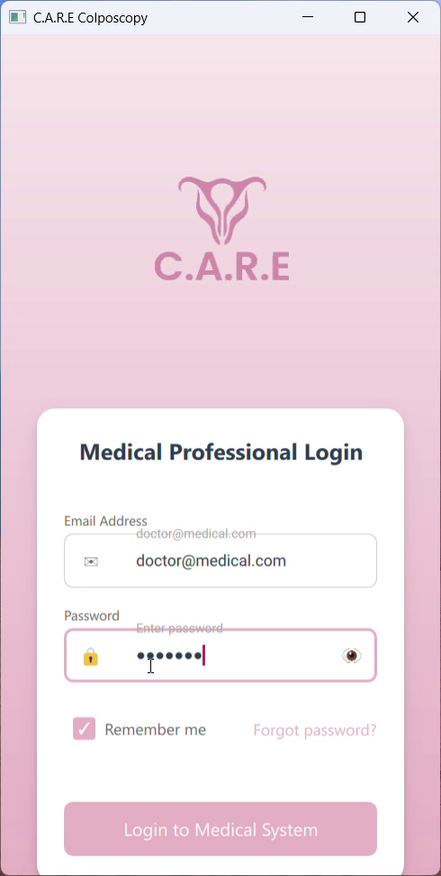

---

### 3.2 Dashboard
Personalized home screen displaying the practitioner's name, specialty, and quick access to main functions: New Exam, Patients, Reports, Statistics. Recent examinations list at the bottom.

`[INSERT: assets/screenshots/02_home.png]`

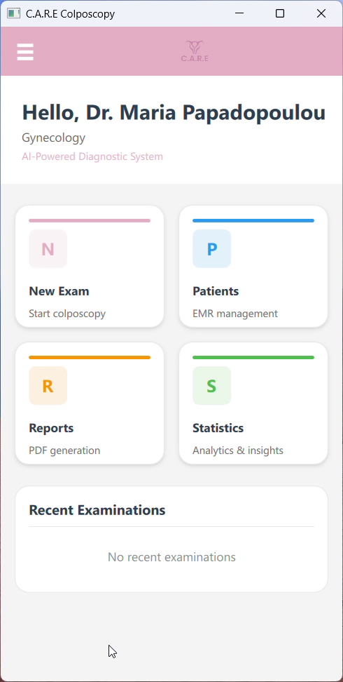

---

### 3.3 Patient List
Complete patient registry with real-time search, medical record number (MRN) display, date of birth, and personalized avatars. Quick-add button for new patients.

`[INSERT: assets/screenshots/03_patient_list.png]`

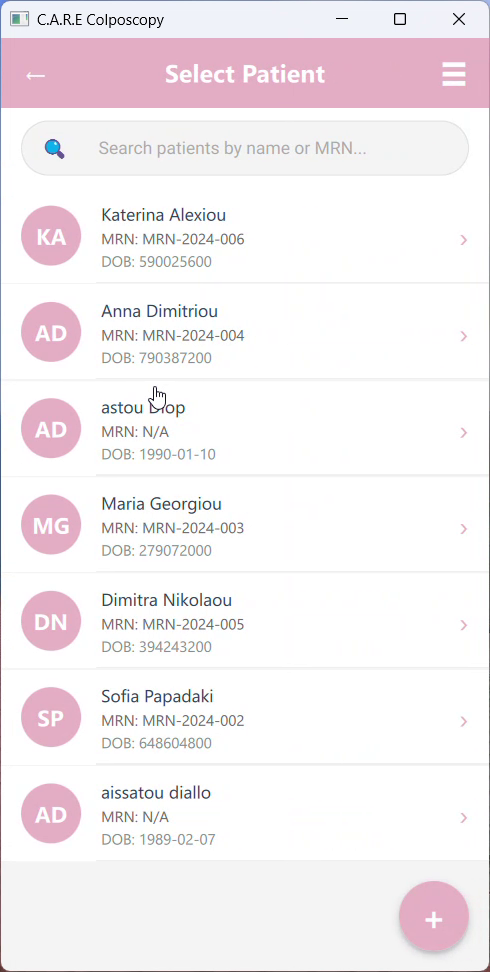

---

### 3.4 Camera Interface with Medical Green Filter
Real-time colposcopic image capture. The **medical green filter** (OpenGL ES 3.0 GPU shader) amplifies the green channel to better visualize cervical vascular patterns — the digital equivalent of the optical green filter used in traditional colposcopy. Adjustable exposure, zoom, and filter intensity controls.

`[INSERT: assets/screenshots/04_camera_green_filter.png]`

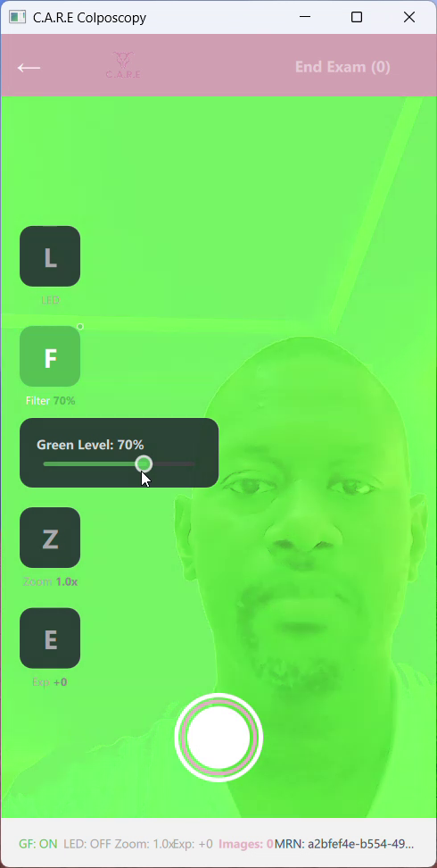

---

### 3.5 Exam Gallery
View of images captured during an examination. Multiple selection for group annotation or report generation. Image count and examination date display.

`[INSERT: assets/screenshots/05_exam_gallery.png]`

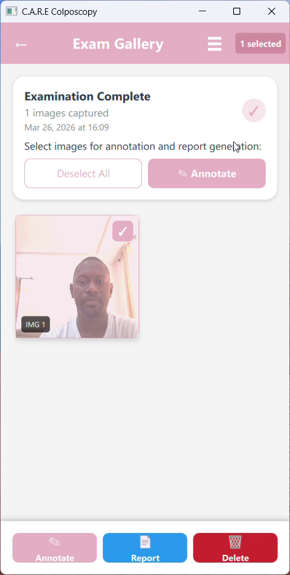

---

### 3.6 Medical Annotation Tools
Complete annotation toolset: circle, line, freehand drawing, rectangle, measurements (in mm), and text. Configurable color palette and stroke width. Integrated **AI Analysis** button for automatic lesion detection.

`[INSERT: assets/screenshots/06_annotation.png]`

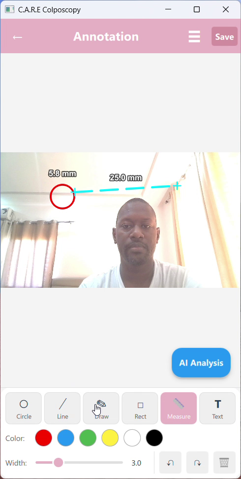

---

### 3.7 Report Generation
Structured colposcopic report generation form: patient information, clinical indication, cervical appearance, transformation zone, acetic acid and iodine findings, vascular patterns, impressions, biopsy, and recommendations.

`[INSERT: assets/screenshots/07_report_generation.png]`

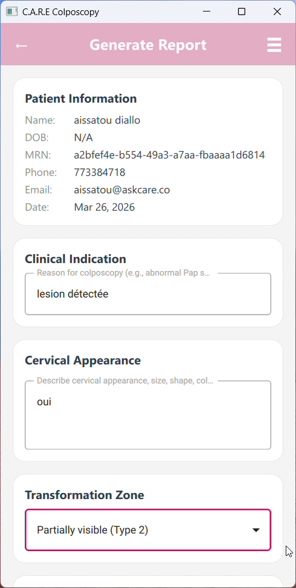

---

### 3.8 Generated PDF Report
Preview of the automatically generated PDF report, including patient information, clinical findings, and annotated images. Professional format with C.A.R.E header.

`[INSERT: assets/screenshots/08_report_pdf.png]`

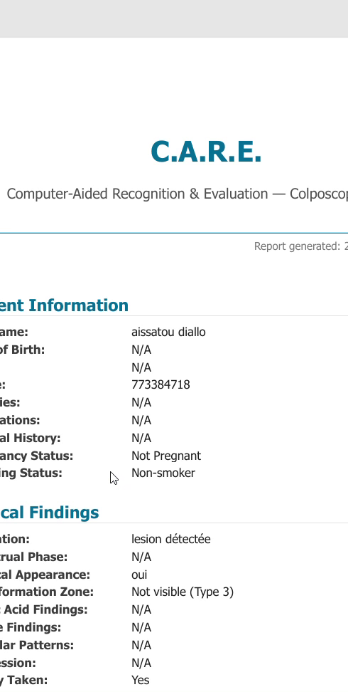

---

### 3.9 Patient Detail Record
Complete patient record with tabs: Contact Information, Medical Information (allergies, medications, history), Gynecological Information (last menstrual period, pregnancy status, contraceptive method). Direct access to the patient's image gallery and reports.

`[INSERT: assets/screenshots/09_patient_detail.png]`

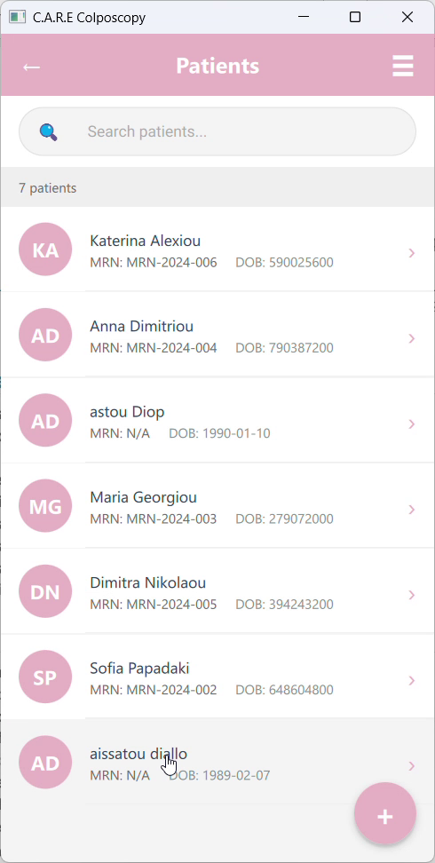

---

### 3.10 Statistics and Charts
Analytical dashboards with: lesion type distribution (donut chart), AI confidence trends (time series), patient age distribution (histogram). Actionable data for epidemiological monitoring.

`[INSERT: assets/screenshots/10_statistics.png]`

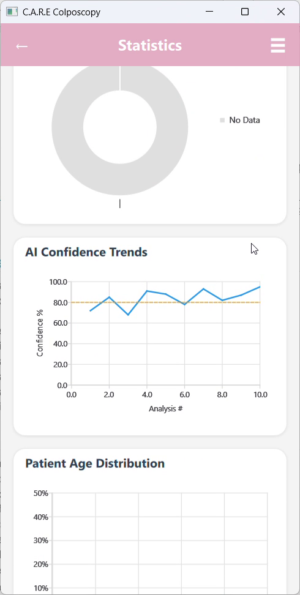

---

### 3.11 User Profile
Practitioner profile management: email, department, specialization, medical license number. Secure password change functionality.

`[INSERT: assets/screenshots/11_profile.png]`

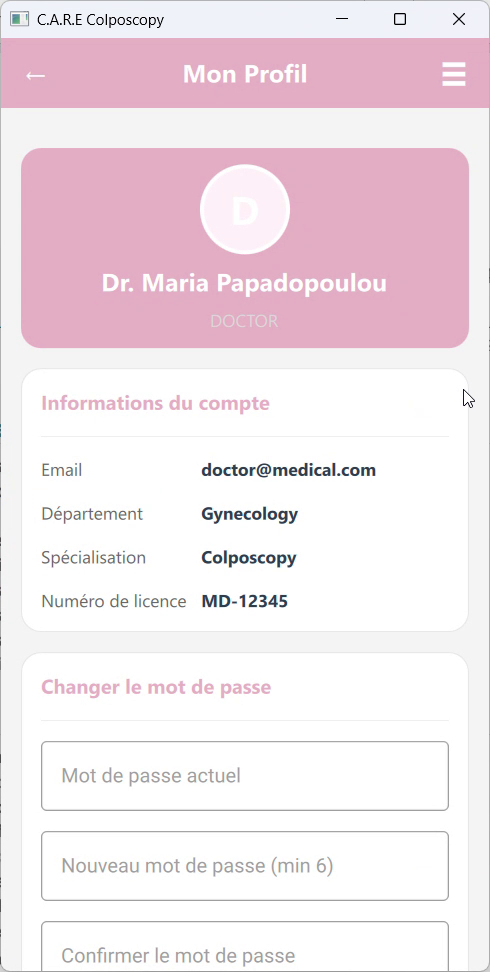

---

### 3.12 Navigation Menu
Side navigation drawer with quick access to all application sections. Connected practitioner identification and role display. Logout option.

`[INSERT: assets/screenshots/12_navigation_drawer.png]`

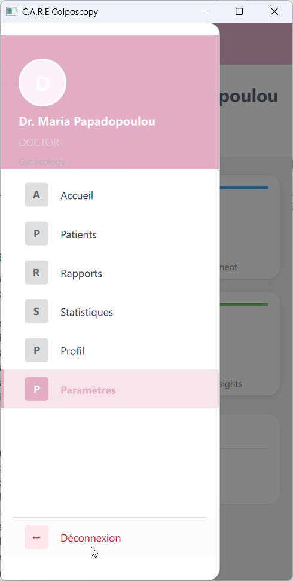

---

## 4. Technology Stack

| Component | Technology | Rationale |
|-----------|-----------|-----------|
| **Framework** | Qt 6.10 (C++17 + QML/JavaScript) | Native cross-platform, medical-grade performance, certification-ready |
| **Database** | SQLite with WAL mode | Lightweight, embedded, offline-capable, performant |
| **Artificial Intelligence** | TensorFlow Lite | Cervical lesion detection, on-device embedded inference |
| **Medical Rendering** | OpenGL ES 3.0 (GPU shader) | Real-time medical green filter, GPU image processing |
| **Architecture** | MVC (Model-View-Controller) | Clean separation of services / models / views |
| **Primary Language** | C++17 | Native performance, deterministic memory management |
| **User Interface** | QML + JavaScript | Fluid declarative UI, material animations |
| **Reports** | Native PDF generation | Automatic structured clinical reports |
| **Security** | SHA-256, account locking | Medical data protection |

---

## 5. Why Qt C++ for Healthcare Software

The choice of **Qt C++** as the primary framework is deliberate for a medical application. It addresses specific requirements of the healthcare industry:

- **IEC 62304 Compliance**: The international standard for medical device software lifecycle is facilitated by deterministic C++ — no garbage collector, no unpredictable memory behavior, complete execution traceability.

- **CE / FDA Certification**: Qt is already used in the medical industry (Siemens MRI devices, Philips patient monitors, GE Healthcare imaging systems). The Qt ecosystem provides traceability and testing tools validated for certification.

- **Single Codebase, All Platforms**: The same source code compiles for Android, Windows, iOS, and Linux. This **significantly reduces certification costs** as only one codebase needs to be validated, tested, and documented.

- **Real-Time Performance**: Medical image processing and GPU rendering (green filter, annotations) require native performance that only C++ can guarantee on resource-constrained mobile devices.

- **No Cloud Dependency**: The application works entirely offline, an essential criterion for medical environments where connectivity is not guaranteed and data sovereignty is mandatory.

---

## 6. Target Platforms

| Platform | Status | Intended Use |
|----------|--------|-------------|
| **Android** (ARM64, ARMv7) | In progress | Clinical smartphones and tablets |
| **Windows** (x64) | Functional | Hospital/clinic workstations |
| **iOS** (ARM64) | Planned | iPad for mobile consultations |
| **C.A.R.E Hardware Prototype** | Planned | **The software will be embedded in the future dedicated C.A.R.E medical device** — a standalone digital colposcope integrating high-definition camera, medical lighting, and embedded AI processing |

---

## 7. Key Features

- **Multi-role authentication**: Super Admin, Admin, Doctor, Assistant — each role with specific permissions
- **Complete patient record management**: Creation, modification, search, medical history, gynecological information
- **Colposcopic image capture** with real-time medical green filter (GPU shader)
- **Advanced medical annotation**: Circle, line, freehand drawing, rectangle, measurements in mm, text
- **AI cervical lesion analysis**: Automatic classification, confidence score (TensorFlow Lite)
- **Automatic PDF report generation**: Structured clinical format with annotated images
- **CSV export** of clinical data for external analysis
- **Statistics and dashboards**: Lesion distribution, AI trends, patient demographics
- **Automatic database backup**
- **Bilingual interface**: French / English
- **Complete offline mode**: No internet dependency — guaranteed autonomous operation

---

## 8. Security and Compliance

| Measure | Description |
|---------|-------------|
| **Password hashing** | SHA-256, never stored in plain text |
| **Account locking** | Automatic after failed attempts |
| **Local storage** | Data only on the device — complete sovereignty |
| **GDPR architecture** | Compliant by design — no cloud data transfer |
| **Audit trail** | Action traceability (planned) |
| **Database encryption** | SQLCipher (planned) |
| **Granular permissions** | Role-based access control |

---

## 9. Roadmap

| Period | Milestone |
|--------|-----------|
| **Q2 2026** | Android deployment finalization + clinical testing begins |
| **Q3 2026** | CE marking certification (Class IIa — medical device software) |
| **Q4 2026** | **C.A.R.E Hardware Prototype v1** — standalone digital colposcope |
| **2027** | iOS deployment + HL7/FHIR integration for hospital interoperability |

---

## 10. Contact

For any technical questions or demonstration requests, please contact the C.A.R.E team.

---

*This document is confidential and intended only for authorized parties in the context of the C.A.R.E Colposcopy project technical evaluation.*
